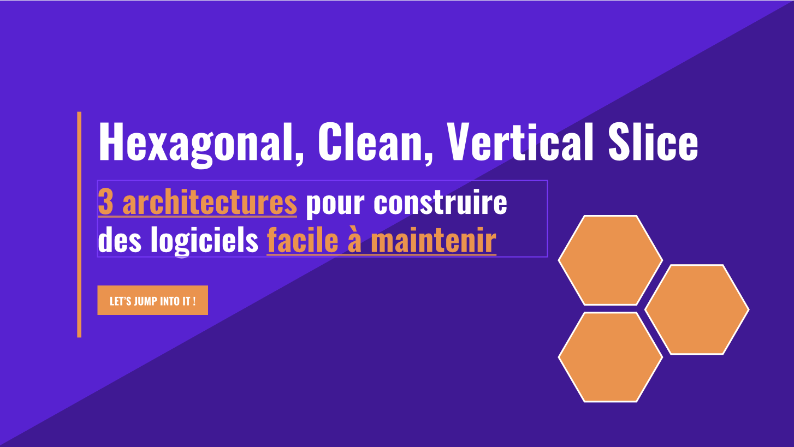

# Hexagonal, Clean, Vertical Slice : 3 architectures pour construire des logiciels facile à maintenir

Ce repository est le code source utilisé pour la présentation du MTG du 30 novembre 2024 faite par [Pierre Gillon](https://github.com/pierregillon)

Il décrit le même périmètre fonctionnel dans plusieurs styles d'architecture.

## Hexagonal

Présente l'architecture ports et adapter selon le standard proposé d'Alistair Cockburn (son créateur).

- 1 seule layer : l'application
- des driving adapters
- des driven adapters

## Clean

Présente la clean architecture de Uncle Bob, simpliée pour l'usage dans une api rest.

- Présentation
- Application
- Domain
- Infrastructure / Data

## Vertical Slice

Présente la vertical slice architecture de Jimmy Bogard.

- 1 seule layer pour tout
- Découpage par fonctionnalité
- Abstraction introduite uniquement si besoin
